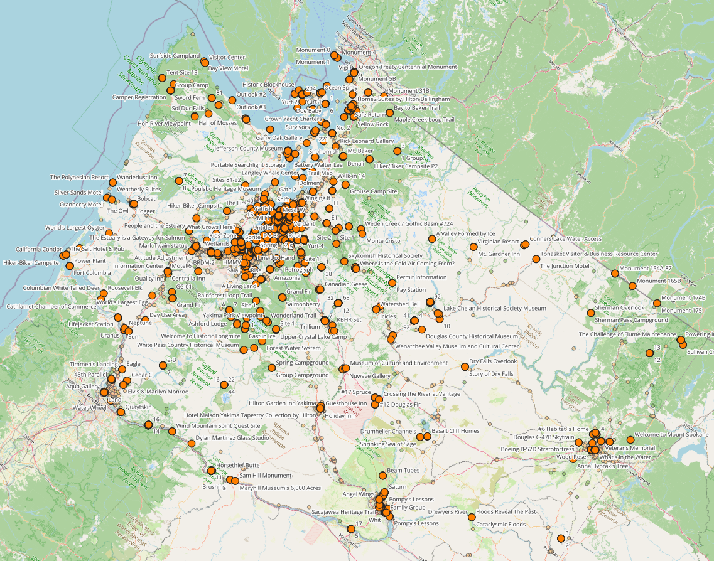

<h1>DC Smart Travel Planner (GIS Project)</h1>

  This project demonstrates how <strong>geospatial analysis</strong>, <strong>QGIS</strong>,
  <strong>Python/GeoPandas</strong>, and a <strong>Leaflet web app</strong> can be used to
  organize and simplify travel planning in <strong>Washington, DC</strong>.

  Instead of showing all points of interest equally, this project cleans OpenStreetMap data,
  groups nearby attractions, scores locations, and creates both a <strong>print-friendly QGIS map</strong>
  and an <strong>interactive web application</strong> where users can choose trip duration,
  hotel/start location, food type, attraction type, parks, and other preferences.

<h2>Live Web App</h2>

  Open the interactive travel planner here:

  <a href="https://namozhdehi.github.io/DC-Smart-Travel-Planner/" target="_blank">
    <strong>Launch DC Smart Travel Planner Web App</strong>
  </a>

  The web app allows users to select:

<ul>
  <li>Trip duration: 1, 2, or 3 days</li>
  <li>Hotel/start location</li>
  <li>Main interests: attractions, parks, and food</li>
  <li>Attraction type such as museum, historic, artwork, garden, and more</li>
  <li>Food type such as cafe, restaurant, fast food, bar, and pub</li>
</ul>

<h2>Final QGIS Print-Friendly Map</h2>

  The project also includes a professional QGIS print layout with title, legend, scale bar,
  north arrow, and a clean map composition.

  Printable PDF version:
  <a href="outputs/dc_travel_planner_map.pdf" target="_blank">
    <strong>outputs/dc_travel_planner_map.pdf</strong>
  </a>

<h2>Project Overview</h2>

  The workflow begins with collecting open geospatial data from <strong>OpenStreetMap</strong>
  using <strong>Overpass Turbo</strong>. The raw datasets include attractions, food locations,
  and parks in Washington, DC.

  The data is then cleaned and prepared in <strong>QGIS</strong>. This included removing incomplete
  records, reducing unnecessary attributes, creating standardized fields, fixing CRS issues,
  and preparing clean final layers for both cartographic output and web mapping.

  For attractions, a clustering and scoring workflow was used to reduce visual clutter and identify
  meaningful travel locations. The final web app then uses the cleaned GeoJSON files to generate
  suggested trip plans based on user preferences.

<h2>Project Folder Structure</h2>

<pre>
DC-Smart-Travel-Planner/
│
├── index.html
├── style.css
├── app.js
├── README.md
│
├── data/
│   ├── raw/
│   │   ├── dc_attractions.geojson
│   │   ├── dc_food.geojson
│   │   └── dc_parks.geojson
│   │
│   ├── processed/
│   │   └── intermediate cleaned QGIS outputs
│   │
│   └── final/
│       ├── dc_top_attractions.geojson
│       ├── dc_food_final.geojson
│       ├── dc_parks_final.geojson
│       ├── dc_top_attractions.gpkg
│       ├── dc_food_final.gpkg
│       └── dc_parks_final.gpkg
│
├── scripts/
│   └── export_gpkg_to_geojson.py
│
├── qgis/
│   └── dc_travel_planner.qgz
│
└── outputs/
    ├── dc_top_attractions_map.png
    └── dc_travel_planner_map.pdf
</pre>

<h2>Methodology</h2>

<ul>
  <li>Collected attraction, food, and park data from OpenStreetMap using Overpass Turbo</li>
  <li>Loaded raw GeoJSON files into QGIS</li>
  <li>Cleaned unnecessary OpenStreetMap attributes</li>
  <li>Created simplified fields such as <strong>name_clean</strong> and <strong>type</strong></li>
  <li>Resolved CRS issues between QGIS, GeoPackage, GeoJSON, and Leaflet</li>
  <li>Used projected CRS for spatial analysis where needed</li>
  <li>Exported web-ready layers to <strong>EPSG:4326</strong></li>
  <li>Created a print-friendly QGIS layout with title, legend, scale bar, and north arrow</li>
  <li>Built a Leaflet web app using HTML, CSS, and JavaScript</li>
  <li>Added user filters for attractions, parks, food, food type, and attraction type</li>
  <li>Generated simple trip suggestions based on distance, selected preferences, and trip duration</li>
</ul>

<h2>Python Automation</h2>

  A Python script was created to convert final QGIS outputs into web-ready GeoJSON files.

  Script location:

<pre>
scripts/export_gpkg_to_geojson.py
</pre>

  The script uses <strong>GeoPandas</strong> to read final GeoPackage files, fix CRS issues,
  convert layers to <strong>EPSG:4326</strong>, and export GeoJSON files used by the web app.

  Final web app data files:

<pre>
data/final/dc_top_attractions.geojson
data/final/dc_food_final.geojson
data/final/dc_parks_final.geojson
</pre>

<h2>Web App Files</h2>

  The interactive web app is built with:

<ul>
  <li><strong>index.html</strong> — page structure and form controls</li>
  <li><strong>style.css</strong> — layout and visual styling</li>
  <li><strong>app.js</strong> — Leaflet map, filters, distance logic, and trip suggestions</li>
</ul>

  The app loads GeoJSON files from:

<pre>
data/final/
</pre>

  The map shows recommended places and updates based on selected user preferences.

<h2>How to Run Locally</h2>

  Because the app loads local GeoJSON files, it should be tested with a local server instead of
  opening <code>index.html</code> directly.

<pre>
cd "/Users/nahid/Desktop/QGIS Portfolio/DC_Travel_Planner"
python3 -m http.server 8000
</pre>

  Then open:

<pre>
http://localhost:8000/index.html
</pre>

  To stop the server:

<pre>
Control + C
</pre>

<h2>Key Technical Challenges Solved</h2>

<ul>
  <li>Fixed CRS problems where layers looked correct in QGIS but not in Leaflet</li>
  <li>Converted UTM/projected coordinates into web-ready longitude and latitude</li>
  <li>Handled inconsistent OpenStreetMap attributes</li>
  <li>Cleaned duplicated or unnecessary fields</li>
  <li>Resolved mixed <strong>type</strong> and <strong>name_clean</strong> fields</li>
  <li>Added browser cache-busting for GeoJSON loading during testing</li>
  <li>Created user-friendly filters for food and attraction preferences</li>
</ul>

<h2>Tools and Technologies</h2>

<ul>
  <li><strong>QGIS</strong> — spatial data cleaning, analysis, and print layout</li>
  <li><strong>Overpass Turbo</strong> — OpenStreetMap data extraction</li>
  <li><strong>OpenStreetMap</strong> — source geospatial data</li>
  <li><strong>Python</strong> — automation workflow</li>
  <li><strong>GeoPandas</strong> — CRS transformation and GeoJSON export</li>
  <li><strong>Leaflet</strong> — interactive web map</li>
  <li><strong>HTML/CSS/JavaScript</strong> — web app interface</li>
  <li><strong>GitHub Pages</strong> — web app hosting</li>
</ul>

<h2>Portfolio Value</h2>

  This project shows the full GIS workflow from raw open data to a polished output:

<ul>
  <li>Data extraction</li>
  <li>Data cleaning</li>
  <li>Spatial analysis</li>
  <li>CRS troubleshooting</li>
  <li>Cartographic design</li>
  <li>Python automation</li>
  <li>Interactive web mapping</li>
  <li>GitHub portfolio presentation</li>
</ul>

<h2>Interview Story</h2>

  I built a DC Smart Travel Planner that combines QGIS, Python, GeoPandas, and Leaflet.
  I started by collecting OpenStreetMap data through Overpass Turbo, then cleaned and standardized
  the data in QGIS. I created final attraction, food, and park layers and designed a print-friendly
  QGIS map layout.

  A major challenge was CRS handling. Some files looked correct in QGIS but did not display correctly
  in the web app because Leaflet requires longitude and latitude coordinates. I used GeoPandas to
  convert final datasets into EPSG:4326 GeoJSON files and validated the coordinate bounds to make sure
  they were web-ready.

  I then built a Leaflet web app where users can choose trip duration, start location, attraction type,
  food type, parks, and other interests. The app generates a simple trip plan and displays the selected
  locations on the map. This project shows my ability to connect desktop GIS analysis, Python automation,
  and web-based geospatial visualization.

<h2>Author</h2>

  <strong>Nahid Mozhdehi</strong> 
  GIS Analyst / GIS Developer focused on geospatial data processing, QGIS, Python automation,
  spatial analysis, and web mapping.

